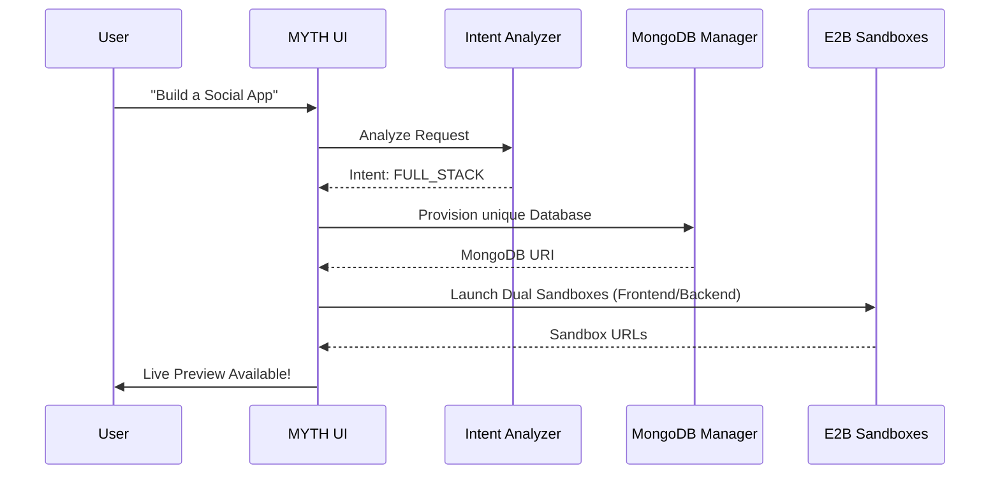
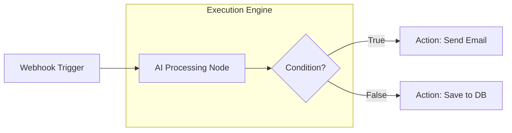

# MYTH-2.0: The Smith of Web 🚀

**MYTH-2.0** is an industry-grade, AI-orchestrated development platform designed to eliminate the friction between ideation and deployment. It leverages a sophisticated multi-agent architecture, secure E2B sandboxes, and real-time cloud provisioning to build Full-Stack MERN applications, Mobile apps, Visual Workflows, and Data Dashboards from natural language.


---

## 📖 Extended Table of Contents

- [🌟 The Vision](#-the-vision)
- [🧠 The Brains: AI Intelligence Layer](#-the-brains-ai-intelligence-layer)
- [🎨 Core Features & Technical Deep Dives](#-core-features--technical-deep-dives)
- [1. Agent AI (AI Agents Builder)](#1-agent-ai-ai-agents-builder)
- [2. Full-Stack MERN Orchestrator](#2-full-stack-mern-orchestrator)
- [3. Application AI (React Native Expo App Builder)](#3-application-ai-react-native-expo-app-builder)
- [4. Data Insight Dashboard (Streamlit)](#4-data-insight-dashboard-streamlit)
- [5. Prompt AI (React Codebase Generator)](#5-prompt-ai-react-codebase-generator)
- [6. URL AI (Website Cloner & Transformer)](#6-url-ai-website-cloner--transformer)
- [🏗 Architectural Diagrams](#-architectural-diagrams)
- [🛠 Engineering Stack](#-engineering-stack)
- [⚙️ Setup & Deployment](#-setup--deployment)
- [📁 Project Topology](#-project-topology)
- [🔌 Advanced API Guide](#-advanced-api-guide)

---

## 🌟 The Vision

MYTH-2.0 isn't just a boilerplate generator. It's an **Intent-Aware Development Environment**. It understands not just *what* you want to build, but *how* it should scale, how the database should be structured, and how the frontend should communicate with the backend. 

---

## 🧠 The Brains: AI Intelligence Layer

The core of MYTH's power lies in its proprietary intelligence libraries:

### 1. Edit Intent Analyzer (`/lib/edit-intent-analyzer.ts`)
A sophisticated regex-and-semantic parser that categorizes user requests into 7 distinct `EditTypes`:
- **`UPDATE_COMPONENT`**: Surgical UI modifications.
- **`ADD_FEATURE`**: Strategic insertion of new logic and pages.
- **`FIX_ISSUE`**: Targeted debugging based on recent modifications.
- **`UPDATE_STYLE`**: High-precision Tailwind CSS adjustments.
- **`REFACTOR` / `FULL_REBUILD` / `ADD_DEPENDENCY`**: Global project state changes.

### 2. Smart Context Selector (`/lib/context-selector.ts`)
Eliminates "hallucinations" by feeding the AI the *perfect* context:
- **Key File Prioritization**: Always includes `App.jsx`, `package.json`, and CSS configs.
- **Component Overlap Protection**: Intelligently warns the AI against creating redundant components (e.g., preventing a new `Nav.jsx` if navigation logic is already inside `Header.jsx`).
- **Token Optimization**: Truncates large context files while preserving structural integrity.

### 3. File Search Executor (`/lib/file-search-executor.ts`)
An agentic search tool that scans the sandbox filesystem using keywords and regex to find exact line numbers for surgical edits, significantly reducing code breakage.

---

## 🎨 Core Features & Technical Deep Dives

### 1. Agent AI (AI Agents Builder) (`/agentai`)
Build autonomous AI agents using a professional node-based canvas.
- **n8n-style Variable Orchestration**: Features a sophisticated `{{nodeId.path}}` resolution system, allowing agents to pipe data dynamically between triggers, AI nodes, and actions.
- **Canvas Engine**: Powered by `@xyflow/react` (React Flow), featuring custom node types (`trigger`, `ai`, `action`, `router`).
- **Persistence Layer**: Cloud-synced workflow management allowing users to save, load, and iterate on complex agent architectures.
- **Live Debugging**: Features a real-time `ExecutionTerminal` that streams logs directly from the workflow's runtime.

### 2. Full-Stack MERN Orchestrator (`/fullstackai`)
The most complex feature in MYTH-2.0.
- **Multi-Sandbox Provisioning**: Spins up two independent E2B sandboxes (Frontend & Backend) that communicate over a secure network.
- **Atlas-on-the-Fly**: Automatically creates unique, isolated MongoDB databases for every project using `mongodb-manager.ts`.
- **Coherence Guard**: The AI ensures that backend Mongoose schemas and frontend API calls (Axios) share identical field naming conventions (e.g., standardizing on `title` and `completed` for CRUD).

### 3. Application AI (React Native Expo App Builder) (`/applicationai`)
The ultimate React Native Expo app builder for mobile-first engineering.
- **Multi-Modal Context Engine**: Support for uploading PDFs (text extraction) and Images (design references) to provide deep context for AI app generation.
- **Metro-in-Sandbox**: Runs a full Metro bundler inside an E2B sandbox for real-time mobile development.
- **Code Portability**: One-click **ZIP Export** allows you to download the entire generated Expo project for local development or production builds.
- **Hyper-Robust Polling**: A multi-stage URL extraction logic that monitors port 8081 and generates a testable QR code.
- **Live Preview**: Scan the generated QR code with **Expo Go** to test your AI-generated app on real hardware instantly.

### 4. Data Insight Dashboard (Streamlit) (`/datatodashboardai`)
- **Python Sandboxing**: Isolated execution of Python 3.10+ environments.
- **Automated Installation**: Background monitoring of `pip install` and `streamlit run` with a 45s heartbeat check.

### 5. Prompt AI (React Codebase Generator) (`/promptai`)
High-speed React application generation from natural language prompts.
- **Speech-to-Text Integration**: Utilize native browser speech recognition to dictate application requirements.
- **Iterative Refinement**: Chat-based code editing with surgical updates to specific components without losing project state.
- **Visual Intelligence**: Support for image-to-code transformations and PDF documentation context.

### 6. URL AI (Website Cloner & Transformer) (`/urlai`)
Clone and transform existing websites instantly.
- **Intelligent Scraping**: Captures full-page screenshots and scrapes structural content from any public URL.
- **Design Transformation**: Use existing websites as a blueprint and transform them into custom React components.
- **Visual Sandbox**: Instantly deploy cloned designs into an interactive sandbox for real-time manipulation.

---

## 🏗 Architectural Diagrams

### Full-Stack Build Pipeline


### Agent Workflow Execution


---

## 🛠 Engineering Stack

| Layer | Tools |
| :--- | :--- |
| **Logic** | Next.js 15 (App Router), TypeScript 5.9 |
| **Execution** | E2B Code Interpreter SDK |
| **Models** | GPT-4o, Claude 3.5 Sonnet, Gemini 3 Pro Preview, Llama 3.3 (Groq) |
| **Database** | MongoDB Atlas, Turso (LibSQL), Drizzle ORM |
| **Styling** | Tailwind CSS 4, Framer Motion, Radix UI |
| **Graphics** | Three.js (Michi 3D Bot), React Flow (Agent Canvas) |

---

## ⚙️ Setup & Deployment

### Environment Variables
Configure your `.env` with the following:
```env
# Infrastructure
E2B_API_KEY=...
TURSO_DATABASE_URL=...
TURSO_AUTH_TOKEN=...
MONGO_DB_PASS=...

# Auth (Clerk)
NEXT_PUBLIC_CLERK_PUBLISHABLE_KEY=...
CLERK_SECRET_KEY=...

# AI Providers (At least one)
OPENAI_API_KEY=...
ANTHROPIC_API_KEY=...
GEMINI_API_KEY=...
GROQ_API_KEY=...
```

### Quick Start
1. `npm install`
2. `npm run db:push`
3. `npm run dev`

---

## 📁 Project Topology

```text
MYTH-2.0/
├── app/
│   ├── agentai/              # AI Agents Builder
│   ├── applicationai/        # React Native Expo App Builder
│   ├── promptai/             # React Codebase Generator
│   ├── urlai/                # Website Cloner & Transformer
│   ├── fullstackai/          # MERN Stack Orchestrator
│   ├── datatodashboardai/    # Streamlit Generator
│   └── api/                  # Heart of Orchestration
├── lib/
│   ├── edit-intent-analyzer/ # Detection Logic
│   ├── context-selector/     # Prompt Engineering
│   ├── mongodb-manager/      # Database Provisioning
│   └── execution-engine/     # Agent Runtime
└── components/
    ├── MichiBot.tsx          # 3D Agent UI
    └── ActionSteps.tsx       # Build Step Visualization
```

---

## 🔌 Advanced API Guide

### `POST /api/create-fullstack-sandbox`
Initializes the dual-sandbox environment. Returns `sessionId`, `frontendUrl`, `backendUrl`, and `databaseConnectionString`.

### `POST /api/agentai/generate-workflow`
Takes a natural language prompt and returns a structured JSON graph compatible with React Flow and our `WorkflowRunner`.

---

**Built by [Junaid Shaikh](https://github.com/swarnim0129)**
*Redefining AI-Assisted Engineering.*
