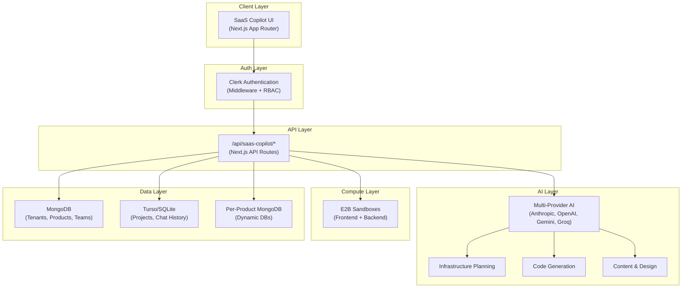

# 🚀 MYTH SaaS Copilot

> **AI-Powered Multi-Tenant Website Builder Platform**
>
> Build, deploy, and manage entire SaaS products — landing pages, dashboards, e-commerce stores, AI agents, and full-stack applications — using drag-and-drop or full AI autopilot, all governed under one control plane.

---

## Table of Contents

- [Overview](#overview)
- [Architecture](#architecture)
- [Screens & Features](#screens--features)
  - [Dashboard (Tenant Control Plane)](#1--dashboard--tenant-control-plane)
  - [Mode Selection](#2--mode-selection)
  - [Drag & Drop Builder](#3-️-drag--drop-builder)
  - [AI Autopilot Builder](#4--ai-autopilot-builder)
  - [Product Detail / Website Editor](#5--product-detail--website-editor)
  - [Team Management](#6--team-management)
  - [Analytics & Usage](#7--analytics--usage)
  - [Billing & Plans](#8--billing--plans)
  - [Tenant Settings](#9-️-tenant-settings)
- [Data Models](#data-models)
- [API Routes](#api-routes)
- [AI Integration](#ai-integration)
- [Technology Stack](#technology-stack)
- [User Flows](#user-flows)
- [Subscription Plans](#subscription-plans)
- [Tenant Isolation & Security](#tenant-isolation--security)
- [File Structure](#file-structure)

---

## Overview

The **SaaS Copilot** is the capstone feature of the MYTH-2.0 platform. It wraps all other MYTH tools (PromptAI, FullStackAI, AgentAI, URLai) into a single **governed multi-tenant SaaS ecosystem** where multiple organizations (tenants) can:

- 🏗️ **Create** websites, apps, dashboards, and AI agents
- 🎨 **Customize** branding, themes, layouts, and content
- 🚀 **Deploy** to production with custom domains
- 📊 **Monitor** traffic, usage, and performance
- 👥 **Collaborate** with team members under role-based access
- 💳 **Subscribe** to plans that control feature access and limits

Each **tenant** is a self-contained organization with isolated data, users, products, and configurations.

---

## Architecture



---

## Screens & Features

### 1. 🏠 Dashboard — Tenant Control Plane

The central hub where tenants see and manage everything.

| Section | Description |
|---------|-------------|
| **Organization Card** | Tenant logo, name, plan badge, industry, team size |
| **Product Grid** | Cards for all products (websites, apps, agents) with status, progress, quick actions |
| **Quick Stats** | Total products, live count, storage used, AI credits remaining |
| **New Product CTA** | Prominent button to create a new product |
| **Capabilities Bar** | Shows buildable product types: Landing Pages, E-Commerce, Dashboards, AI Agents, APIs, Full SaaS |
| **Recent Activity** | Timeline of actions across all products |
| **Search & Filter** | Search products by name, filter by type/status |

**Key Features:**
- Real-time status indicators (Live / Building / Draft / Archived)
- Progress bars on products under construction
- One-click navigation to any product's editor
- Drag-and-drop reordering of product cards

---

### 2. ➕ Mode Selection

Choose how to build a new product.

| Mode | Description | Best For |
|------|-------------|----------|
| **Drag & Drop Builder** | Visual React Flow canvas, connect infrastructure components, real-time preview | Builders who want control over architecture |
| **AI Autopilot** | Describe what you want in natural language, AI builds everything | Non-technical users, rapid prototyping |

**Additional Options:**
- **Product Type Pre-selector** — Landing Page, E-Commerce, Dashboard, AI Agent, Full SaaS
- **Template Gallery** — Pre-built starters per product type
- **Import Existing** — From URL (Firecrawl scraping), ZIP upload, GitHub repo

---

### 3. 🖱️ Drag & Drop Builder

Visual infrastructure builder powered by **React Flow** (same engine as AgentAI).

#### Component Library (Draggable Nodes):

| Category | Components |
|----------|-----------|
| **Pages** | Landing Page, Dashboard, E-Commerce Store, Blog, Auth Pages, Admin Panel |
| **Backend** | REST API, GraphQL, WebSocket, Cron Jobs, Webhooks |
| **Database** | MongoDB, PostgreSQL, Redis Cache |
| **Auth** | Sign In/Up, OAuth, Role Manager |
| **AI** | Chatbot, Content Generator, Image Generator, Agent |
| **Integrations** | Stripe, SendGrid, Twilio, S3, Vercel |
| **Analytics** | Dashboard Widget, Charts, Metrics, Reports |

#### Key Features:
- **Node Config Panel** — Click any node to configure it (e.g., page layout, DB schema, API endpoints)
- **Edge Data Flow** — Connecting nodes defines data flow (Frontend → API → Database)
- **Page Builder Sub-screen** — Double-click a page node → opens section-level drag-drop (Hero, Features, Pricing, FAQ, etc.)
- **Live Preview** — Side panel or popout showing the running application
- **"Generate All"** — Send entire graph to AI for batch code generation
- **One-click Deploy** — Provision sandbox → build → deploy

---

### 4. 🤖 AI Autopilot Builder

Full conversational AI builder. Describe your SaaS → AI creates everything.

#### Layout:
- **Left: Chat Interface** — Messages, suggested prompts, quick-select chips, file attachments, voice input
- **Right: Build Pipeline** — Real-time status of each infrastructure component being generated

#### AI Pipeline Steps:
1. **Analyze Requirements** — Parse prompt, identify needed components
2. **Generate Plan** — Show infrastructure graph before building
3. **Code Generation** — Per-component streaming code generation
4. **Sandbox Provisioning** — Create E2B sandboxes (frontend + backend)
5. **Database Setup** — Provision MongoDB via manager
6. **Build & Deploy** — Compile, install dependencies, start servers
7. **Preview** — Live preview URL available
8. **Iterate** — Chat to refine ("Add dark mode", "Change pricing layout")

---

### 5. 🌐 Product Detail / Website Editor

Accessed by clicking any product card from the Dashboard.

#### Tabs:

| Tab | Description |
|-----|-------------|
| **Pages** | List of all pages, click to edit in visual Page Builder |
| **Theme & Brand** | Colors, fonts, logo, favicon, CSS customization |
| **Navigation** | Menu structure editor with drag-to-reorder and nesting |
| **Content CMS** | Blog posts, product listings, media library |
| **Backend** | API routes, database viewer, environment variables |
| **Agents** | AI chatbots/agents attached to this product |
| **Domain & Deploy** | Custom domain management, deployment history, DNS verification |
| **Settings** | SEO metadata, analytics tracking codes, redirects, error pages |

#### Page Builder Features:
- Drag-drop sections: Hero, Navbar, Features Grid, Testimonials, Pricing Table, FAQ, Contact Form, Gallery, Blog Feed, Footer
- Per-section configuration (text, images, colors, layout)
- Responsive preview toggle (Mobile / Tablet / Desktop)
- Draft ↔ Published workflow
- Version history with rollback support

---

### 6. 👥 Team Management

Multi-user collaboration with role-based access control.

#### Roles & Permissions:

| Permission | Owner | Admin | Editor | Developer | Viewer |
|-----------|:-----:|:-----:|:------:|:---------:|:------:|
| Create products | ✅ | ✅ | ❌ | ❌ | ❌ |
| Edit content | ✅ | ✅ | ✅ | ❌ | ❌ |
| Manage code/backend | ✅ | ✅ | ❌ | ✅ | ❌ |
| Deploy to production | ✅ | ✅ | ❌ | ❌ | ❌ |
| Manage team | ✅ | ✅ | ❌ | ❌ | ❌ |
| View billing | ✅ | ✅ | ❌ | ❌ | ❌ |
| View analytics | ✅ | ✅ | ✅ | ✅ | ✅ |

**Features:**
- Email invitation system
- Role assignment and modification
- Activity logs per team member
- Pending invitations list

---

### 7. 📊 Analytics & Usage

Comprehensive usage monitoring and traffic analytics.

| Widget | Description |
|--------|-------------|
| **Traffic Overview** | Page views, unique visitors, bounce rate per product |
| **Resource Usage** | Storage, AI credits, bandwidth with limit bars |
| **Performance** | Response times, error rates, uptime percentage |
| **Product Breakdown** | Per-product stats table with sparkline charts |
| **AI Usage** | Prompt history, tokens consumed, generation count |
| **Alerts** | Notifications when approaching plan limits |

---

### 8. 💳 Billing & Plans

Subscription management with plan-based feature gating.

| Feature | Free | Pro ($29/mo) | Enterprise ($99/mo) |
|---------|:----:|:-----------:|:-------------------:|
| Products | 2 | 10 | Unlimited |
| Pages per product | 5 | 50 | Unlimited |
| Storage | 500MB | 10GB | 100GB |
| AI generations/mo | 50 | 500 | Unlimited |
| Custom domains | ❌ | 3 | Unlimited |
| Team members | 1 | 5 | Unlimited |
| Real-time collab | ❌ | ✅ | ✅ |
| Priority support | ❌ | ❌ | ✅ |
| Advanced analytics | ❌ | ✅ | ✅ |
| White-label | ❌ | ❌ | ✅ |
| Version history | 7 days | 30 days | Unlimited |

---

### 9. ⚙️ Tenant Settings

| Section | Description |
|---------|-------------|
| **General** | Org name, slug, logo, industry, tagline |
| **Branding Defaults** | Default colors, fonts, brand guidelines |
| **Domains** | Subdomain management, custom domain setup |
| **Integrations** | GitHub, Vercel, Stripe, SendGrid |
| **API Keys** | Tenant-level API key management |
| **Danger Zone** | Transfer ownership, archive, delete tenant |

---

## Data Models

### Tenant
```
id, clerkUserId, name, slug, logo, industry, plan,
settings { brandColors, defaultFont, customDomains, features },
usage { productsCount, storageUsedMB, aiCreditsUsed, limits... },
createdAt, updatedAt
```

### Product
```
id, tenantId, name, slug, description, type, status, progress,
buildMode, infrastructure { nodes, edges },
pages [{ title, route, sections, isDraft }],
sandboxId, previewUrl, productionUrl, customDomain,
databaseName, files, branding, deployHistory, chatHistory,
createdAt, updatedAt
```

### TeamMember
```
id, tenantId, clerkUserId, email, name, role, status,
invitedBy, joinedAt, createdAt
```

### Activity
```
id, tenantId, productId, userId, action, details, createdAt
```

---

## API Routes

All routes are under `app/api/saas-copilot/`:

```
/tenants                          → GET, POST
/tenants/[id]                     → GET, PUT, DELETE
/tenants/[id]/products            → GET, POST
/tenants/[id]/products/[pid]      → GET, PUT, DELETE
/tenants/[id]/products/[pid]/pages    → GET, POST, PUT
/tenants/[id]/products/[pid]/deploy   → POST
/tenants/[id]/products/[pid]/preview  → POST
/tenants/[id]/products/[pid]/infra    → GET, PUT
/tenants/[id]/products/[pid]/chat     → POST (streaming)
/tenants/[id]/products/[pid]/generate → POST (AI pipeline)
/tenants/[id]/team                → GET, POST, PUT, DELETE
/tenants/[id]/analytics           → GET
/tenants/[id]/billing             → GET, POST
/tenants/[id]/settings            → GET, PUT
/tenants/[id]/activity            → GET
```

---

## AI Integration

| Capability | How It Works |
|-----------|-------------|
| **Infrastructure Planning** | AI analyzes prompt → generates React Flow graph (nodes + edges) |
| **Code Generation** | Per-component code gen via `generate-ai-code-stream` + `generate-mern-code` |
| **Page Layout** | AI generates responsive HTML/React sections from prompt + product type |
| **Content Writing** | AI creates copy, headings, CTAs, blog posts for pages |
| **DB Schema Design** | AI designs collections/tables from business requirements |
| **API Generation** | AI generates REST/GraphQL endpoints from data models |
| **Admin Panel** | AI creates CRUD dashboard for all product data models |
| **Chatbot Setup** | AI creates custom chatbot with system prompt + tools for each product |

---

## Technology Stack

| Layer | Technology |
|-------|-----------|
| **Framework** | Next.js 15 (App Router) |
| **UI** | React, Tailwind CSS, Framer Motion |
| **Canvas** | React Flow (drag-drop builder) |
| **Auth** | Clerk (SSO, RBAC, middleware) |
| **Primary DB** | MongoDB (mongoose) |
| **Project DB** | Turso/SQLite (drizzle ORM) |
| **Per-Product DBs** | MongoDB (auto-provisioned) |
| **Code Sandboxes** | E2B Code Interpreter |
| **AI Providers** | Anthropic Claude, OpenAI GPT-4, Google Gemini, Groq |
| **Scraping** | Firecrawl (for URL import) |

---

## User Flows

### Creating a SaaS via AI Autopilot
```
Dashboard → "New Project" → AI Autopilot
→ Describe SaaS in chat → AI generates plan
→ User approves → AI generates code component by component
→ E2B sandbox created → MongoDB provisioned
→ Live preview available → User refines via chat
→ Deploy to production → Product appears on Dashboard as "Live"
```

### Building via Drag & Drop
```
Dashboard → "New Project" → Drag & Drop
→ Drag components onto React Flow canvas
→ Configure each node (pages, DB, APIs)
→ Connect nodes with edges (data flow)
→ Double-click page node → Page Builder opens
→ Drag sections → configure content
→ Preview → Deploy → Live
```

### Managing Existing Products
```
Dashboard → Click product card → Product Detail
→ Edit pages, theme, navigation, content
→ View backend, manage agents, configure domain
→ Publish changes → View deployment history
```

### Team Collaboration
```
Dashboard → Team → Invite member (email + role)
→ Member joins → Gets role-based access
→ Can edit/view based on permission matrix
→ Activity tracked in tenant logs
```

---

## Tenant Isolation & Security

- **Data Isolation** — Each tenant's products, team, settings stored with `tenantId` foreign key
- **Auth Isolation** — Clerk ensures users only access their own tenant data
- **Database Isolation** — Each product gets its own MongoDB database via `mongodb-manager`
- **Feature Isolation** — Plan-based feature flags control what each tenant can access
- **API Isolation** — All API routes verify `tenantId` ownership before any operation
- **RBAC** — Team members have role-specific permissions enforced server-side

---

## File Structure

```
app/saas_copilot/
├── page.tsx                    # Root screen controller + all UI screens
├── README.md                   # This documentation

app/api/saas-copilot/           # All backend API routes
├── tenants/[id]/products/...   # Product CRUD + deploy + generate
├── tenants/[id]/team/...       # Team management
├── tenants/[id]/analytics/...  # Usage analytics
└── tenants/[id]/billing/...    # Plan management

lib/models/
├── tenant.model.ts             # Tenant mongoose schema
├── product.model.ts            # Product mongoose schema
├── team-member.model.ts        # Team member mongoose schema
└── activity.model.ts           # Activity log mongoose schema
```
